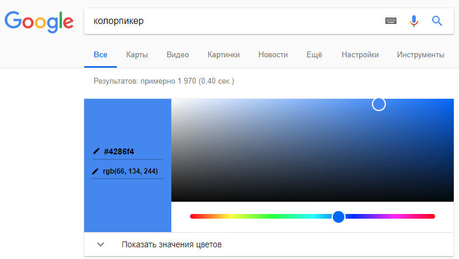

# Цвета CSS

::: details Темы
- Стандартные
- HEX
- RGB
:::

```css
div {
	background-color: orange; /* фон */
	color: blue;              /* цвет текста */
}
```

<!-- xxxxxxxxxxxxxxxxxxxxxxxxxxxxxxxxxxxxxxxxxxxxxxxxxxxxxxx -->
### Google Color Picker
<!-- xxxxxxxxxxxxxxxxxxxxxxxxxxxxxxxxxxxxxxxxxxxxxxxxxxxxxxx -->


```css
div {
	background-color: orange;            /* стандартное название */
	background-color: #4286f4;           /* hex */
	background-color: rgb(66, 134, 244); /* rgb */
}
```

[Названия цветов](https://drafts.csswg.org/css-color/#named-colors)
