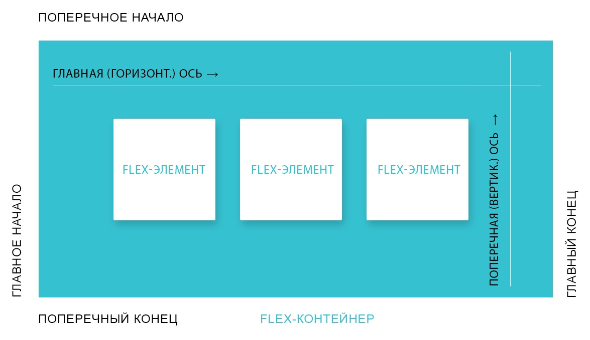
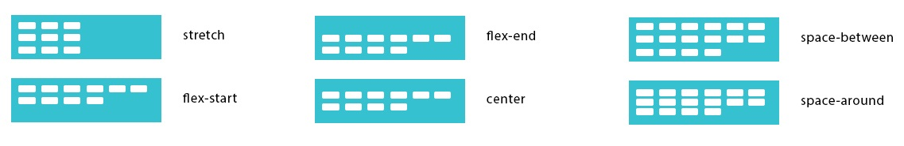

# Flexbox


- [A Complete Guide to Flexbox](https://css-tricks.com/snippets/css/a-guide-to-flexbox/)
- [Игра Flexbox Froggy](https://flexboxfroggy.com/#ru)
- [Flexbugs](https://github.com/philipwalton/flexbugs)


<!-- xxxxxxxxxxxxxxxxxxxxxxxxxxxxxxxxxxxxxxxxxxxxxxxxxxxxxxx -->
### Информация
<!-- xxxxxxxxxxxxxxxxxxxxxxxxxxxxxxxxxxxxxxxxxxxxxxxxxxxxxxx -->


- `Main Axis` - главная ось (по горизонтали)
- `Cross Axis` - второстепенная ось (по вертикали)


<!-- xxxxxxxxxxxxxxxxxxxxxxxxxxxxxxxxxxxxxxxxxxxxxxxxxxxxxxx -->
### Flex-контенер
<!-- xxxxxxxxxxxxxxxxxxxxxxxxxxxxxxxxxxxxxxxxxxxxxxxxxxxxxxx -->

<!------------------------------------------------------------->
#### `display`
<!------------------------------------------------------------->
```css
.flex-container {
	display: flex;         /* Задание flex */
	display: inline-flex;  /* Задание inline-flex */
}
```

<!------------------------------------------------------------->
#### `gap`
<!------------------------------------------------------------->
- Задает расстояние между flex-элементами

```css
.flex-container {
	gap: 10px;
}
```

<!------------------------------------------------------------->
#### `flex-flow: row nowrap`
<!------------------------------------------------------------->
- Рекомендуется использовать flex-flow, a не отдельные свойства (работает быстрее)

<!-- .............. START ......................... -->
<v-padding padding="left">
<template v-slot:first>

<!------------------------------------------------------------->
#### `flex-direction: row`
<!------------------------------------------------------------->
- Задаёт направление основных осей в контейнере


```css
.flex-container {
	flex-direction: row;              /* Расположение блоков по горизонтали (по умолчанию) */
	flex-direction: row-reverse;      /* Расположение блоков по горизонтали (реверсионно) */
	flex-direction: column;           /* Расположение блоков по вертикали */
	flex-direction: column-reverse;   /* Расположение блоков по вертикали (реверсионно) */
}
```

<!------------------------------------------------------------->
#### `flex-wrap: nowrap`
<!------------------------------------------------------------->
- Задает перенос флексов


```css
.flex-container {
	flex-wrap: nowrap;           /* Флексы выстраиваются в одну линию */
	flex-wrap: wrap;             /* Флексы выстраиваются в несколько строк */
	flex-wrap: wrap-reverse;     /* Флексы выстраиваются в несколько строк реверсивно */
}
```
</template>
</v-padding>
<!-- ............... END .......................... -->


<!------------------------------------------------------------->
#### `justify-content: flex-start`
<!------------------------------------------------------------->
- Управляет размещением элемента вдоль главной оси (по горизонтали)


```css
.flex-container {
	justify-content: flex-start;       /* Флексы прижаты к началу строки */
	justify-content: flex-end;         /* Флексы прижаты к концу строки */
	justify-content: center;           /* Флексы выравниваются по центру строки */
	justify-content: space-between;    /* Флексы равномерно располагаются с одинаковыми расстояниями между ними (первый и последний элемент прижимаются к краям контейнера) */
	justify-content: space-around;     /* Флексы равномерно располагаются с одинаковыми расстояниями вокруг них (первый и последний элемент не прижимаются к краям контейнера) */
	justify-content: space-evenly      /* Флексы распределяются таким образом, чтобы расстояние между любыми двумя элементами (и расстояние до краев) было одинаковым */
}
```

<!------------------------------------------------------------->
#### `align-items: stretch`
<!------------------------------------------------------------->
- Управляет размещением элемента вдоль второстепенной оси (по вертикали)


```css
.flex-container {
	align-items: flex-start;       /* Флексы выравниваются в начале поперечной оси контейнера */
	align-items: flex-end;         /* Флексы выравниваются в конце поперечной оси контейнера */
	align-items: center;           /* Флексы выравниваются по линии поперечной оси */
	align-items: stretch;          /* Флексы растягиваются таким образом, чтобы занять всё доступное пространство контейнера */
	align-items: baseline;         /* Флексы выравниваются по их базовой линии (по нижней части параграфа) */
}
```

<!------------------------------------------------------------->
#### `align-content: stretch`
<!------------------------------------------------------------->
- Выравнивание многострочных элементов по вертикали (указывает, как несколько рядов должны отделяться друг от друга)
- align-content отвечает за расстояние между рядами, в то время как align-items отвечает за то, как элементы в целом будут выровнены в контейнере. Когда только один ряд, align-content ни на что не влияет



```css
.flex-container {
	align-content: flex-start;       /* Флексы располагаются в начале поперечной оси. Каждая следующая строка идёт вровень с предыдущей */
	align-content: flex-end;         /* Флексы располагаются начиная с конца поперечной оси. Каждая предыдущая строка идёт вровень со следующей */
	align-content: center;           /* Флексы располагаются по центру контейнер */
	align-content: space-between;    /* Флексы равномерно располагаются с одинаковыми расстояниями между ними (первый и последний элемент прижимаются к краям контейнера) */
	align-content: space-around;     /* Флексы равномерно располагаются с одинаковыми расстояниями вокруг них (первый и последний элемент не прижимаются к краям контейнера) */
	align-content: stretch;          /* Флексы растягиваются, заполняя контейнер равномерно (по умолчанию) */
}
```


<!-- xxxxxxxxxxxxxxxxxxxxxxxxxxxxxxxxxxxxxxxxxxxxxxxxxxxxxxx -->
### Flex-элемент
<!-- xxxxxxxxxxxxxxxxxxxxxxxxxxxxxxxxxxxxxxxxxxxxxxxxxxxxxxx -->

<!------------------------------------------------------------->
#### `flex: 0 1 auto`
<!------------------------------------------------------------->
- Блоки растягиваются на всю ширину контейнера (`flex = flex-grow = 1`)

```css
.flex-element {
	flex: auto;
	flex: 1;
	flex-grow: 1;
}
```

```css
.flex-element {
	flex: 1 1 auto;  /* Занимают равное место, пока влезают */
	flex: 1 1 250px; /* Указали фиксированную минимальную ширину */
}
```

<!-- .............. START ......................... -->
<v-padding padding="left">
<template v-slot:first>

<!------------------------------------------------------------->
#### `flex-grow: 0`
<!------------------------------------------------------------->
- Определяет для flex-элемента возможность растягиваться по ширине

```css
.flex-element {
	flex-grow: 2; /* Если для всех flex-item, то это равные 2 части от container-flex (заполнят всю ширину блока) */
}
```

<!------------------------------------------------------------->
#### `flex-shrink: 1`
<!------------------------------------------------------------->
- Определяет возможность блока ужиматься при необходимости
- Необходимо задать ширину элемента

```css
.flex-element {
	flex-shrink: 2;
}
```

<!------------------------------------------------------------->
#### `flex-basis: auto`
<!------------------------------------------------------------->
- Базовый размер отдельно взятого блока. Задает размер элемента вдоль главной оси
- При `flex-direction: row` соответствует CSS-свойству `width`
- При `flex-direction: column` соответствует CSS-свойству `height`

```css
.flex-element {
	flex-basis: 100px; /* Вместо width */
	flex-basis: 0;     /* Дополнительное пространство вокруг контента не учитывается */
	flex-basis: auto;  /* Дополнительное пространство распределяется на основе его значения flex-grow */
}
```
</template>
</v-padding>
<!-- ............... END .......................... -->

<!------------------------------------------------------------->
#### `order: 0`
<!------------------------------------------------------------->
- Определяет порядок вывода флексов

```css
.flex-element {
	order: 0;          /* По умолчанию у всех элементов */
	order: 3;          /* Элемент выводится третьим по порядку */
	order: -1;         /* Элемент выводится первым по порядку */
}
```

<!------------------------------------------------------------->
#### `align-self: auto`
<!------------------------------------------------------------->
- Переопределяет значение свойства align-items (позволяет вручную управлять выравниванием конкретного элемента)

```css
.flex-element {
	align-self: auto;             /* Выравнивать как указано у контейнера (по умолчанию) */
	align-self: flex-start;       /* Флексы выравниваются в начале поперечной оси контейнера */
	align-self: flex-end;         /* Флексы выравниваются в конце поперечной оси контейнера */
	align-self: center;           /* Флексы выравниваются по линии поперечной оси */
	align-self: stretch;          /* Флексы растягиваются таким образом, чтобы занять всё доступное пространство контейнера */
	align-self: baseline;         /* Флексы выравниваются по их базовой линии (по нижней части параграфа) */	
}
```

<!-- xxxxxxxxxxxxxxxxxxxxxxxxxxxxxxxxxxxxxxxxxxxxxxxxxxxxxxx -->
### Поведение `margin`
<!-- xxxxxxxxxxxxxxxxxxxxxxxxxxxxxxxxxxxxxxxxxxxxxxxxxxxxxxx -->

- Центрирование элемента

```css
.flex-element {
	margin: auto;        /* Центрирует один блок по горизонтали и вертикали */
	margin-left: auto;   /* Выравнивает блок по правому краю, а остальные блоки по левому */
	margin-top: auto;
	margin-right: auto;
	margin-bottom: auto;
}	
```
