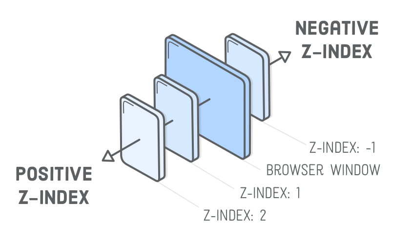

# position

<!-- xxxxxxxxxxxxxxxxxxxxxxxxxxxxxxxxxxxxxxxxxxxxxxxxxxxxxxx -->
### Виды позиционирования
<!-- xxxxxxxxxxxxxxxxxxxxxxxxxxxxxxxxxxxxxxxxxxxxxxxxxxxxxxx -->
```css
div {
	position: static;    /* статичное (стандартное позиционирование) */
	position: relative;  /* относительное (положение устанавливается относительно его исходного места) */
	position: absolute;  /* абсолютное (отсчёт координат ведётся от края окна браузера, если у родителя не установлено position: relative) */
	position: fixed;     /* фиксированное (привязывается к указанной свойствами left, top, right, bottom и точке на экране) */
	position: sticky;    /* липкое (сочетание относительного и фиксированного позиционирования) */
}
```


<!-- xxxxxxxxxxxxxxxxxxxxxxxxxxxxxxxxxxxxxxxxxxxxxxxxxxxxxxx -->
### Свойства: `left`, `right`, `top`, `bottom`
<!-- xxxxxxxxxxxxxxxxxxxxxxxxxxxxxxxxxxxxxxxxxxxxxxxxxxxxxxx -->
- Применяются для всех видов позиционирования кроме `static`

```css
div {
	position: relative;
	top: 100px;
	left: 70px;
}
```

<!-- xxxxxxxxxxxxxxxxxxxxxxxxxxxxxxxxxxxxxxxxxxxxxxxxxxxxxxx -->
### Порядок расположения элементов: `z-index`
<!-- xxxxxxxxxxxxxxxxxxxxxxxxxxxxxxxxxxxxxxxxxxxxxxxxxxxxxxx -->


```css
div {
	z-index: 1;
}
```

