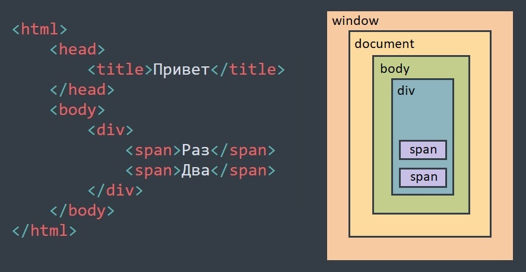

# Выборка элементов страницы

<!-- xxxxxxxxxxxxxxxxxxxxxxxxxxxxxxxxxxxxxxxxxxxxxxxxxxxxxxx -->
### Объектная модель представления документа
<!-- xxxxxxxxxxxxxxxxxxxxxxxxxxxxxxxxxxxxxxxxxxxxxxxxxxxxxxx -->

- `DOM` (Document Object Model) - объектная модель представления документа
- Независящий от платформы и языка программирования способ представления документа, позволяющий программам и скриптам получить доступ к содержимому HTML, XHTML и XML документов, а также изменять содержимое, структуру и оформление таких документов
- Всё содержимое документа представлено в виде иерархии объектов
- Структура этой иерархии стандартизирована, чтобы обеспечить независимость от платформы


<!-- xxxxxxxxxxxxxxxxxxxxxxxxxxxxxxxxxxxxxxxxxxxxxxxxxxxxxxx -->
### Структура DOM документа
<!-- xxxxxxxxxxxxxxxxxxxxxxxxxxxxxxxxxxxxxxxxxxxxxxxxxxxxxxx -->


<!-- xxxxxxxxxxxxxxxxxxxxxxxxxxxxxxxxxxxxxxxxxxxxxxxxxxxxxxx -->
### Выборка элементов страницы
<!-- xxxxxxxxxxxxxxxxxxxxxxxxxxxxxxxxxxxxxxxxxxxxxxxxxxxxxxx -->
```js
const a = document.querySelector('.nav.bar');         // возвращает первый элемент внутри документа
const a = document.querySelectorAll('.nav');          // возвращает список элементов в пределах документа
```

```js
const a = document.getElementById('item');            // по id
const a = document.getElementsByClassName('item')[0]; // по названию класса (первый элемент)
const a = document.getElementsByName('item');         // по атрибуту name
const a = document.getElementsByTagName('img');       // по названию тега (все элементы)
```
