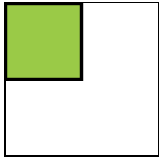
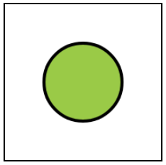
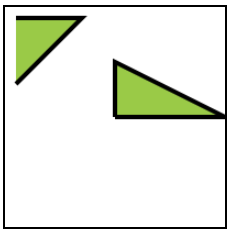
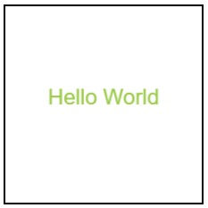

# HTML5 рисование на Canvas

<!-- xxxxxxxxxxxxxxxxxxxxxxxxxxxxxxxxxxxxxxxxxxxxxxxxxxxxxxx -->
### Информация
<!-- xxxxxxxxxxxxxxxxxxxxxxxxxxxxxxxxxxxxxxxxxxxxxxxxxxxxxxx -->
- [https://www.w3schools.com](https://www.w3schools.com/tags/ref_canvas.asp)
- [PixiJS](https://www.pixijs.com/)
- [three.js](https://threejs.org/)


<!-- xxxxxxxxxxxxxxxxxxxxxxxxxxxxxxxxxxxxxxxxxxxxxxxxxxxxxxx -->
### HTML
<!-- xxxxxxxxxxxxxxxxxxxxxxxxxxxxxxxxxxxxxxxxxxxxxxxxxxxxxxx -->
```html
<canvas id="canvas" style="display: block; border: 2px solid black;">
	Your browser is not supported
</canvas>
```

<!-- xxxxxxxxxxxxxxxxxxxxxxxxxxxxxxxxxxxxxxxxxxxxxxxxxxxxxxx -->
### Основы
<!-- xxxxxxxxxxxxxxxxxxxxxxxxxxxxxxxxxxxxxxxxxxxxxxxxxxxxxxx -->

<!------------------------------------------------------------->
#### Выборка и получение контекста
<!------------------------------------------------------------->
```js
const canvas = document.getElementById('canvas');
const ctx = canvas.getContext('2d');
canvas.width = 200;
canvas.height = 200;
//canvas.width = window.innerWidth;
//canvas.height = window.innerHeight;
```

<!------------------------------------------------------------->
#### Общие свойства
<!------------------------------------------------------------->
```js
ctx.fillStyle = 'yellowgreen';
ctx.strokeStyle = 'black';
ctx.lineWidth = 4;
```

<!-- xxxxxxxxxxxxxxxxxxxxxxxxxxxxxxxxxxxxxxxxxxxxxxxxxxxxxxx -->
### Объекты
<!-- xxxxxxxxxxxxxxxxxxxxxxxxxxxxxxxxxxxxxxxxxxxxxxxxxxxxxxx -->

<!------------------------------------------------------------->
#### `Rectangle`
<!------------------------------------------------------------->
<!-- .............. START ......................... -->
<v-two grow>
<template v-slot:first>

```js
ctx.fillRect(0,0,100,100);   // fill
ctx.strokeRect(0,0,100,100); // stroke
```
</template>
<template v-slot:last>


</template>
</v-two>
<!-- ............... END .......................... -->


<!------------------------------------------------------------->
#### `Arc`
<!------------------------------------------------------------->
<!-- .............. START ......................... -->
<v-two grow>
<template v-slot:first>

```js
ctx.beginPath();
ctx.arc(100, 100, 50, 0, Math.PI*2, false);
ctx.closePath();
ctx.fill();   // fill
ctx.stroke(); // stroke
```
</template>
<template v-slot:last>


</template>
</v-two>
<!-- ............... END .......................... -->

__`arc()`__
- `1` - координаты центра окружности (x)
- `2` - координаты центра окружности (y)
- `3` - радиус
- `4` - start angle (справа)
- `5` - end angle (360deg = pi*2)
- `6` - рисование по часовой (false) / против (true) часовой стрелки


<!------------------------------------------------------------->
#### `Line`, `Path`
<!------------------------------------------------------------->

<!-- .............. START ......................... -->
<v-two grow>
<template v-slot:first>

```js
ctx.beginPath();

ctx.moveTo(100, 100);
ctx.lineTo(100, 50);
ctx.lineTo(200, 100);
ctx.closePath();

ctx.moveTo(10, 10);
ctx.lineTo(70, 10);
ctx.lineTo(10, 70);

ctx.fill();
ctx.stroke();
```
</template>
<template v-slot:last>


</template>
</v-two>
<!-- ............... END .......................... -->


<!------------------------------------------------------------->
#### `Text`
<!------------------------------------------------------------->
<!-- .............. START ......................... -->
<v-two grow>
<template v-slot:first>

```js
ctx.textAlign = 'center';
ctx.font = '22px Arial';
ctx.fillText('Hello World', canvas.width/2, canvas.height/2); // по центру
```
</template>
<template v-slot:last>


</template>
</v-two>
<!-- ............... END .......................... -->

