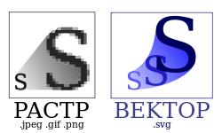

# Изображения

::: details Темы
- Изображения
- Фоновые изображения
:::


<!-- xxxxxxxxxxxxxxxxxxxxxxxxxxxxxxxxxxxxxxxxxxxxxxxxxxxxxxx -->
### Виды компьютерной графики
<!-- xxxxxxxxxxxxxxxxxxxxxxxxxxxxxxxxxxxxxxxxxxxxxxxxxxxxxxx -->
- Растровая
- Векторная
- Трехмерная




<!-- xxxxxxxxxxxxxxxxxxxxxxxxxxxxxxxxxxxxxxxxxxxxxxxxxxxxxxx -->
### Форматы изображений
<!-- xxxxxxxxxxxxxxxxxxxxxxxxxxxxxxxxxxxxxxxxxxxxxxxxxxxxxxx -->
- `.jpg` - растровая графика без прозрачности (н-р: Adobe Photoshop)
- `.png` - растровая графика с прозрачностью (н-р: Adobe Photoshop)
- `.svg` - векторная графика (н-р: Adobe Illustrator)


<!-- xxxxxxxxxxxxxxxxxxxxxxxxxxxxxxxxxxxxxxxxxxxxxxxxxxxxxxx -->
### ``
<!-- xxxxxxxxxxxxxxxxxxxxxxxxxxxxxxxxxxxxxxxxxxxxxxxxxxxxxxx -->
```html

```

- При одновременном задании `width` и `height` на css возникает искажение пропорций. Поэтому следует задавать только `width` или только `height`
- Без искажения пропорций применяется свойство `object-fit` со значениями contain или cover


<!-- xxxxxxxxxxxxxxxxxxxxxxxxxxxxxxxxxxxxxxxxxxxxxxxxxxxxxxx -->
#### `object-fit`
<!-- xxxxxxxxxxxxxxxxxxxxxxxxxxxxxxxxxxxxxxxxxxxxxxxxxxxxxxx -->
- `cover` - элемент увеличивается или уменьшается, чтобы целиком заполнить заданную область с сохранением пропорций
- `contain` - элемент масштабируется, чтобы целиком уместиться в заданные размеры с соблюдением пропорций

```css
img {
	object-fit: cover;
	object-fit: contain;
}
```


<!-- xxxxxxxxxxxxxxxxxxxxxxxxxxxxxxxxxxxxxxxxxxxxxxxxxxxxxxx -->
### CSS свойство: `background-...`
<!-- xxxxxxxxxxxxxxxxxxxxxxxxxxxxxxxxxxxxxxxxxxxxxxxxxxxxxxx -->
```css
div {
	background-image: url(img.png);                       /* путь к изображению */
	background-image: linear-gradient(90deg, #fff, #fff); /* линейный градиент */
	background-repeat: no-repeat;                         /* повторение изображения */
	background-position: center center;                   /* позиционирование изображения (задние в px и %) */
	background-size: contain;                             /* изображение полностью помещается в блок */
	background-size: cover;                               /* изображение заполняет весь блок */
	background-size: 50%;                                 /* задание в % */
	background-color: #3b3b3b;                            /* цвет фона */
	background-attachment: fixed;                         /* будет ли прокручиваться фоновое изображение */
	background: url(img.png) no-repeat center 50%;        /* сокращенная запись */
}
```


<!-- xxxxxxxxxxxxxxxxxxxxxxxxxxxxxxxxxxxxxxxxxxxxxxxxxxxxxxx -->
### CSS свойство: `linear-gradient`
<!-- xxxxxxxxxxxxxxxxxxxxxxxxxxxxxxxxxxxxxxxxxxxxxxxxxxxxxxx -->
```css
div {
	background-image: linear-gradient(#e66465, #9198e5);
	background-image: linear-gradient(90deg, #fff, #fff);
}
```

- `0deg` - сверху вниз
- `90deg` - справа налево
- `180deg` - снизу вверх
- `270deg`- слева направо


<!-- xxxxxxxxxxxxxxxxxxxxxxxxxxxxxxxxxxxxxxxxxxxxxxxxxxxxxxx -->
### Применение
<!-- xxxxxxxxxxxxxxxxxxxxxxxxxxxxxxxxxxxxxxxxxxxxxxxxxxxxxxx -->
- **Применение img**: - логотипы, картинки товаров, уникальные изображения, которые должны индексироваться поисковиками
- **Применение: background-image** - фоновые изображения


<!-- xxxxxxxxxxxxxxxxxxxxxxxxxxxxxxxxxxxxxxxxxxxxxxxxxxxxxxx -->
### Оптимизация изображений
<!-- xxxxxxxxxxxxxxxxxxxxxxxxxxxxxxxxxxxxxxxxxxxxxxxxxxxxxxx -->
[https://tinypng.com/](https://tinypng.com/)
