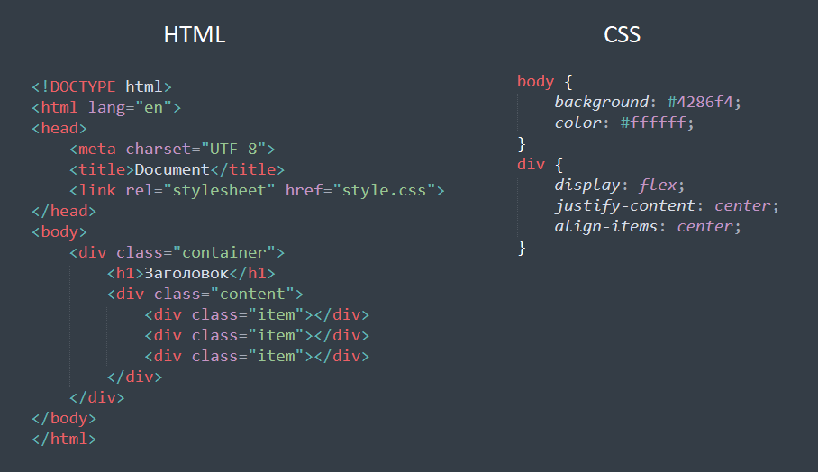

# Организация структуры проекта

<!-- xxxxxxxxxxxxxxxxxxxxxxxxxxxxxxxxxxxxxxxxxxxxxxxxxxxxxxx -->
### Структура проекта
<!-- xxxxxxxxxxxxxxxxxxxxxxxxxxxxxxxxxxxxxxxxxxxxxxxxxxxxxxx -->
```bash
index.html    # главный файл
favicon.png   # иконка для сайта
robots.txt    # файл для поисковых роботов
sitemap.xml   # карта сайта
```

```bash
css           # папка для стилей
fonts         # папка для шрифтов
img           # папка для изображений
js            # папка для javascript скриптов
libs          # папка для javascript библиотек
php           # папка для php скриптов
sass          # папка для sass файлов
```

<!-- xxxxxxxxxxxxxxxxxxxxxxxxxxxxxxxxxxxxxxxxxxxxxxxxxxxxxxx -->
### Стилистика написания кода
<!-- xxxxxxxxxxxxxxxxxxxxxxxxxxxxxxxxxxxxxxxxxxxxxxxxxxxxxxx -->
- Выравнивание
- Именование файлов и классов (английский язык, не транслит, слитно)
- Именование классов: `item-element`, `item_element`, `itemElement`
- Секции на сайте: `content`, `container`, `wrapper`, `item`, `title`, `description`
- Сервисы для форматирования кода: [https://www.10bestdesign.com/dirtymarkup/](https://www.10bestdesign.com/dirtymarkup/)

<!------------------------------------------------------------->
#### Пример правильного выравнивания кода
<!------------------------------------------------------------->



<!-- xxxxxxxxxxxxxxxxxxxxxxxxxxxxxxxxxxxxxxxxxxxxxxxxxxxxxxx -->
### Sublime Text (комбинации клавиш)
<!-- xxxxxxxxxxxxxxxxxxxxxxxxxxxxxxxxxxxxxxxxxxxxxxxxxxxxxxx -->
```bash
Tab            # сдвинуть строки вправо
Shift+Tab      # сдвинуть строки влево
Ctrl+Shift+D   # продублировать строку
Ctrl+F         # поиск
F3             # продолжить поиск на странице
Ctrl+Shift+F   # поиск с заменой
Ctrl + /       # комментарий
```

<!-- xxxxxxxxxxxxxxxxxxxxxxxxxxxxxxxxxxxxxxxxxxxxxxxxxxxxxxx -->
### Комментарии
<!-- xxxxxxxxxxxxxxxxxxxxxxxxxxxxxxxxxxxxxxxxxxxxxxxxxxxxxxx -->
- Комментарий на HTML

```html
<!-- здесь текст комментария -->
```

- Комментарий на CSS
```css
/* здесь текст комментария */
```
