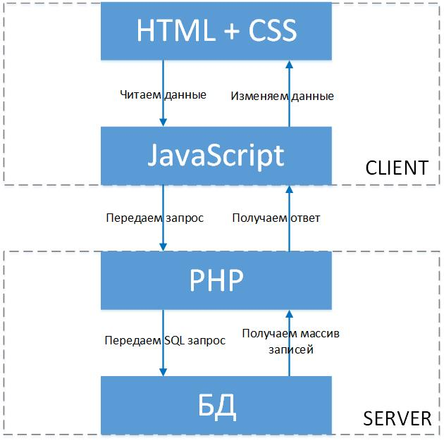

# Отправка сообщения на почту





<!-- xxxxxxxxxxxxxxxxxxxxxxxxxxxxxxxxxxxxxxxxxxxxxxxxxxxxxxx -->
### Обращение к php скрипту через Ajax
<!-- xxxxxxxxxxxxxxxxxxxxxxxxxxxxxxxxxxxxxxxxxxxxxxxxxxxxxxx -->

- [Denwer](https://yadi.sk/d/XoMo5o8ZZHQ1eQ)
- [Open Server](https://ospanel.io/)


<!-- xxxxxxxxxxxxxxxxxxxxxxxxxxxxxxxxxxxxxxxxxxxxxxxxxxxxxxx -->
### Отправка сообщения на почту
<!-- xxxxxxxxxxxxxxxxxxxxxxxxxxxxxxxxxxxxxxxxxxxxxxxxxxxxxxx -->
```js
$.get("php/mail.php", {message:'Сообщение'}, function(data) {
    alert(data);
});
```

```php
<?php
	$to      = 'user@example.com, anotheruser@example.com'; // получатель / получатели
	$subject = 'Письмо с сайта';                            // тема письма
	$message = $_GET[message];                              // сообщение

	$email = mail($to, $subject, $message);
	if ($email) {
	    echo 'Письмо успешно отправлено!';
	} else {
	    echo 'Письмо не отправлено!';
	}
?>
```


